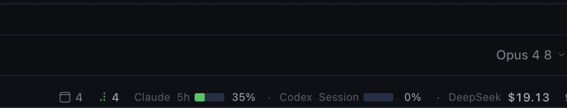

# Hermes Monitor

Kanban worker health in the Desktop status bar.

Hermes Monitor adds two compact items to the right side of the Hermes Desktop footer. Worker health is the primary feature. Provider quota usage is included as a secondary readout.

```text
[Worker 2 · build · 18 s ago]  [Claude 34% 12:40 · Codex 61% 14:00 · DeepSeek $7.25]
```



Open the Worker item to see each running card, its title, assignee, runtime, last activity, and a link to Kanban. Open the Quotas item for the full Claude, Codex, and DeepSeek details. Both menus request a fresh reading when opened.

## Requirements

- Hermes 0.21 or later
- Hermes Desktop

## Install in Hermes

[Install in Hermes](hermes://plugin/install?repo=mr-3mm3/hermes-monitor)

Install the package:

```sh
hermes plugins install mr-3mm3/hermes-monitor
```

Enable its backend for the active Hermes home. This adds `hermes-monitor` to `plugins.enabled`:

```sh
hermes plugins enable hermes-monitor
```

Quit Hermes Desktop completely with Command-Q, then reopen it. In the app, open Capabilities -> Plugins and enable Hermes Monitor.

### From a local checkout

To run the plugin from a working copy instead of an installed release, symlink the package into the Hermes plugin directory:

```sh
ln -s "$PWD" ~/.hermes/plugins/hermes-monitor
hermes plugins enable hermes-monitor
```

Add `hermes-monitor` to `plugins.enabled` if the enable command is unavailable, then restart the gateway (`hermes gateway restart`) so the backend routes are loaded, and quit and reopen Hermes Desktop so the footer items appear.

### Official catalog publication

The Hermes plugin catalog accepts owner-maintained public repositories through a pull request that adds `plugin-catalog/hermes-monitor.yaml` to `NousResearch/hermes-agent`. The entry must pin an exact 40-character commit SHA, describe the plugin's actual capabilities, and pass the catalog validation workflow. Published plugins must have a release/tag and must not update their own installed files; updates are reviewed as catalog SHA-bump pull requests.

## Worker health states

Hermes Monitor reads running Kanban cards and their local worker activity:

- Active: recent worker activity.
- Stalled: no activity for more than five minutes.
- Loop: the same tool with the same arguments appears at least four times in a row in the latest events.

Loop has priority over stalled, and stalled has priority over active when several workers are running. The footer spinner runs while at least one worker is active.

## Quotas

The quota item shows used percentage and reset time for the Claude five-hour and weekly windows and the windows returned by Codex. DeepSeek shows the remaining account balance. Missing credentials or provider failures are displayed as `n/a` and do not interrupt the status bar.

DeepSeek credentials are resolved from the process environment, the Hermes root `.env`, then the first profile `.env` containing `DEEPSEEK_API_KEY` in alphabetical profile order.

## Privacy

The backend opens the local Kanban and worker session databases in read-only mode. It returns activity metadata only. Message content and tool arguments never reach the frontend; arguments are represented by hashes for loop detection.

Credentials stay in the backend and are never returned to the Desktop plugin. The only external requests are the DeepSeek balance API call and the account-usage API calls already used by Hermes for Claude and Codex. Each external call has a 15-second timeout, and quota results are cached for five minutes.

## Development

Requirements: Python 3.11+ with `pytest`, and Node.js for the syntax check. The backend tests are pure logic with fixtures and never make real network calls.

```sh
python3 -m pytest tests/ -q
node --check desktop/plugin.js
```

The backend lives in `dashboard/` (`plugin_api.py` wires the routes, `workers.py` and `quotas.py` hold the pure transformations) and the Desktop half is the single module `desktop/plugin.js`.

## Related

If you mainly need provider quota tracking, see `ai-usage-tracker` in the Hermes plugin catalog. Hermes Monitor focuses on Kanban worker health and includes quotas as a secondary feature.

## License

MIT. See [LICENSE](LICENSE).
